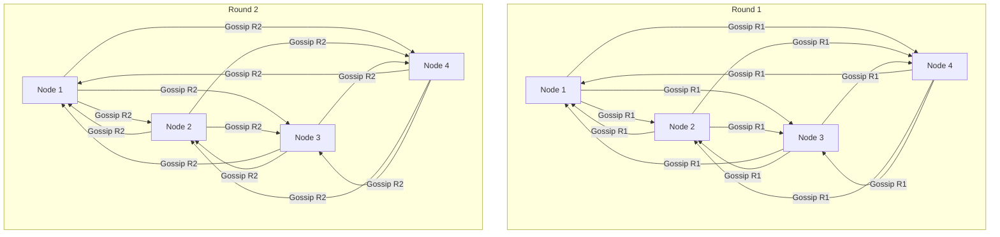

```mermaid
graph TD
    subgraph "Round 1"
        N1[Node 1] -->|Gossip R1| N2[Node 2]
        N1 -->|Gossip R1| N3[Node 3]
        N1 -->|Gossip R1| N4[Node 4]
        N2[Node 2] -->|Gossip R1| N1
        N2 -->|Gossip R1| N3
        N2 -->|Gossip R1| N4
        N3[Node 3] -->|Gossip R1| N1
        N3 -->|Gossip R1| N2
        N3 -->|Gossip R1| N4
        N4[Node 4] -->|Gossip R1| N1
        N4 -->|Gossip R1| N2
        N4 -->|Gossip R1| N3
    end
    subgraph "Round 2"
        N1_2[Node 1] -->|Gossip R2| N2_2[Node 2]
        N1_2 -->|Gossip R2| N3_2[Node 3]
        N1_2 -->|Gossip R2| N4_2[Node 4]
        N2_2[Node 2] -->|Gossip R2| N1_2
        N2_2 -->|Gossip R2| N3_2
        N2_2 -->|Gossip R2| N4_2
        N3_2[Node 3] -->|Gossip R2| N1_2
        N3_2 -->|Gossip R2| N2_2
        N3_2 -->|Gossip R2| N4_2
        N4_2[Node 4] -->|Gossip R2| N1_2
        N4_2 -->|Gossip R2| N2_2
        N4_2 -->|Gossip R2| N3_2
    end
```